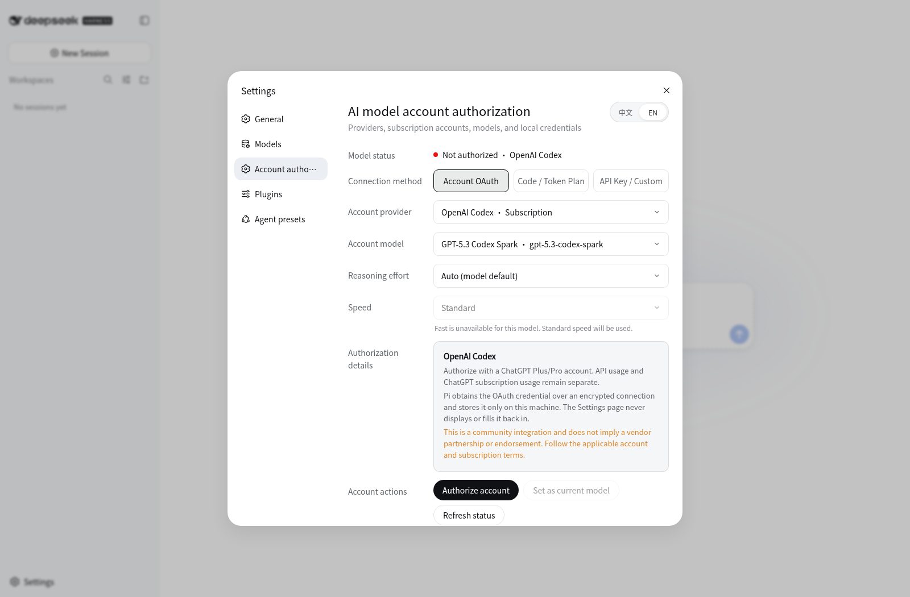

# dsh-oauth-models

[English](README.md) | [简体中文](README.zh-CN.md)

Community OAuth model providers for [DeepSeek Harness](https://github.com/deepseek-ai/DeepSeek-Harness). The plugin connects supported ChatGPT and Claude subscription accounts to DSH through the OAuth flows owned by `@earendil-works/pi-ai`, without asking users to paste an API key into the settings page.



## Features

- Authorize OpenAI Codex with a ChatGPT Plus/Pro account.
- Authorize Anthropic with a Claude Pro/Max account.
- Complete remote OAuth by pasting the final localhost callback URL back into DSH.
- Manage authorization, model selection, reasoning effort and speed inside the native DSH Settings panel.
- Switch the authorization page between English and Simplified Chinese.
- Show only the reasoning efforts supported by the selected model, including Off, Minimal, Low, Medium, High, Extra High and Max where available.
- Keep Standard and Fast as an independent speed setting; Fast is enabled only for models whose provider metadata supports it.
- Route Code / Token Plan and API Key / Custom configuration back to DSH's native Models page.
- Refresh expired OAuth credentials through Pi and persist the result atomically.
- Work alongside `dsh-auth`: `dsh-auth` protects access to the DSH Web interface, while this plugin keeps model-provider credentials in a separate local store.

## Requirements

- Node.js 22 or newer
- DeepSeek Harness `0.1.0-rc.6`

## Install from source

```bash
git clone https://github.com/Aiden0727/dsh-oauth-models.git
cd dsh-oauth-models
npm ci --registry=https://registry.npmjs.org/
npm run verify
npm pack
dsh plugin --profile web add ./dsh-oauth-models-0.6.3.tgz
```

The package produced by `npm pack` is a local installation artifact. `*.tgz` files are ignored by Git and are not published in this repository.

Restart `dsh web` after installation. Open **Settings → Account authorization**, choose OpenAI Codex or Anthropic, select a model, and start the account authorization flow. Once authorization succeeds, the provider becomes available in the DSH model selector.

### Remote browser callback

When DSH runs on another machine, the official provider may finish by redirecting the browser to a URL such as `http://localhost:1455/auth/callback?...`. The browser cannot reach the callback listener on the remote DSH host and may show a connection error. Copy the complete URL from the browser address bar, return to **Account authorization**, paste it into **Complete remote authorization**, and submit it. Pi validates the OAuth state and PKCE exchange before saving the credential on the DSH host. Do not copy credential files between machines.

The standalone fallback page remains available at:

```text
http://127.0.0.1:3080/oauth-models
```

The actual port follows your DSH Web configuration.

## Security boundary

- OAuth credentials are stored only in `$DSH_HOME/oauth-credentials.json` with file mode `0600`.
- `$DSH_HOME` is restricted to directory mode `0700`.
- Credentials are not written to `settings.yaml`, plugin configuration, the settings UI, screenshots or logs.
- Credential refreshes use a cross-process lock and atomic replacement.
- Authorization control endpoints accept only loopback and same-origin requests and reject cross-site requests and DNS-rebinding hosts.
- `dsh-auth` credentials and provider OAuth credentials are stored and handled separately.

## Development

```bash
npm run typecheck
npm test
npm run verify
```

`npm run verify` checks TypeScript, validates the browser bundle, runs the test suite and performs an npm package dry run.

## Uninstall

```bash
dsh plugin --profile web remove dsh-oauth-models
```

Removing the plugin does not delete `$DSH_HOME/oauth-credentials.json`. To revoke local authorization data, sign out from the authorization page before uninstalling. You should also revoke the application from the corresponding account security page when appropriate.

## Disclaimer

This is an independent community integration. It is not endorsed by, affiliated with or certified by DeepSeek, OpenAI or Anthropic. Using subscription-account authorization remains subject to the applicable provider account and subscription terms.

## License

[MIT](LICENSE)
