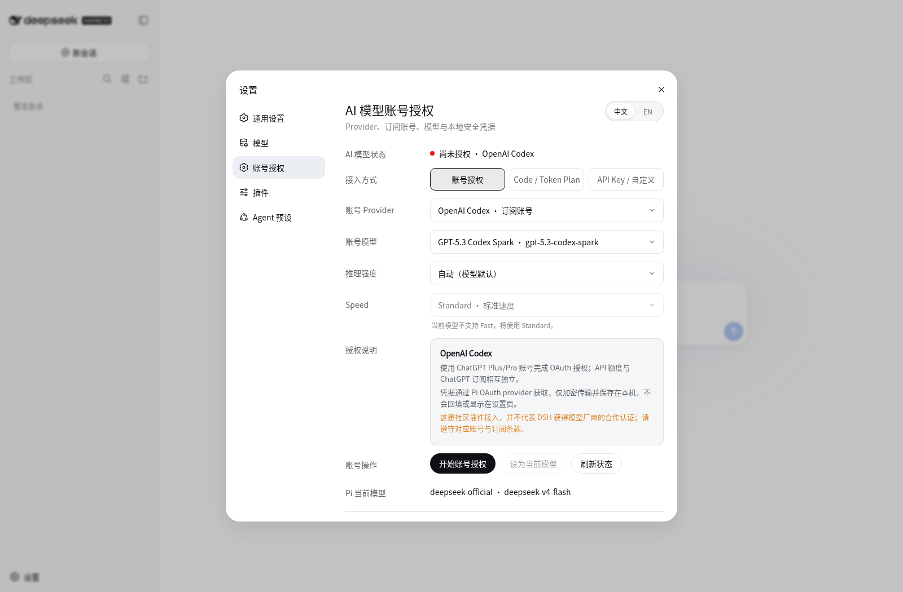

# dsh-oauth-models

[English](README.md) | [简体中文](README.zh-CN.md)

这是一个面向 [DeepSeek Harness](https://github.com/deepseek-ai/DeepSeek-Harness) 的社区 OAuth 模型插件。它通过 `@earendil-works/pi-ai` 所有的 OAuth 流程，把受支持的 ChatGPT 与 Claude 订阅账号接入 DSH，不要求用户在设置页面粘贴 API Key。



## 功能

- 使用 ChatGPT Plus/Pro 账号授权 OpenAI Codex。
- 使用 Claude Pro/Max 账号授权 Anthropic。
- 支持把最终的 localhost 回调链接粘贴回 DSH，以完成远程 OAuth。
- 在 DSH 原生设置面板中管理授权、模型、推理强度和速度。
- 授权页面支持英文和简体中文切换。
- 根据所选模型动态展示可用推理强度；支持时可选择关闭、极低、低、中、高、超高和最大。
- Standard 与 Fast 是独立的速度设置；仅在 Provider 元数据声明模型支持时开放 Fast。
- Code / Token Plan 与 API Key / 自定义配置入口会转到 DSH 原生“模型”页面。
- 通过 Pi 刷新过期的 OAuth 凭据，并以原子方式写回本地文件。
- 可与 `dsh-auth` 配合使用：`dsh-auth` 保护 DSH Web 入口，本插件则在独立的本地存储中管理模型 Provider 凭据。

## 环境要求

- Node.js 22 或更高版本
- DeepSeek Harness `0.1.0-rc.6`

## 从源码安装

```bash
git clone https://github.com/Aiden0727/dsh-oauth-models.git
cd dsh-oauth-models
npm ci --registry=https://registry.npmjs.org/
npm run verify
npm pack
dsh plugin --profile web add ./dsh-oauth-models-0.6.6.tgz
```

`npm pack` 生成的压缩包只作为本地安装产物使用。Git 已忽略所有 `*.tgz` 文件，仓库不会上传这些文件。

安装后重启 `dsh web`。打开 **设置 → 账号授权**，选择 OpenAI Codex 或 Anthropic，再选择模型并开始账号授权。授权成功后，对应 Provider 会出现在 DSH 模型选择器中。

### 远程浏览器回调

当 DSH 运行在另一台机器上时，官方 Provider 可能在授权完成后把浏览器跳转到 `http://localhost:1455/auth/callback?...`。浏览器无法访问远程 DSH 主机上的回调监听器，因此可能显示连接失败。此时复制浏览器地址栏中的完整链接，返回 **账号授权** 页面，粘贴到 **完成远程授权** 并提交。Pi 会继续验证 OAuth state 和 PKCE，再把凭据保存在 DSH 主机上；不需要在机器之间复制凭据文件。

独立兜底页面仍然可用：

```text
http://127.0.0.1:3080/oauth-models
```

实际端口以 DSH Web 配置为准。

## 安全边界

- OAuth 凭据只写入 `$DSH_HOME/oauth-credentials.json`，文件权限为 `0600`。
- `$DSH_HOME` 目录权限会收紧为 `0700`。
- 凭据不会写入 `settings.yaml`、插件配置、设置页面、截图或日志。
- 凭据刷新使用跨进程文件锁和原子替换。
- 授权控制接口只接受本机回环地址和同源请求，并拒绝跨站请求与 DNS rebinding Host。
- `dsh-auth` 凭据与模型 Provider 的 OAuth 凭据会分开保存和处理。

## 开发与验证

```bash
npm run typecheck
npm test
npm run verify
```

`npm run verify` 会执行 TypeScript 检查、浏览器端脚本语法检查、完整测试以及 npm 打包预检。

## 卸载

```bash
dsh plugin --profile web remove dsh-oauth-models
```

移除插件不会删除 `$DSH_HOME/oauth-credentials.json`。如需撤销本地授权数据，请先在授权页面退出账号再卸载；必要时也应在对应账号的安全页面撤销应用授权。

## 免责声明

本项目是独立的社区集成，不代表 DeepSeek、OpenAI 或 Anthropic 对其提供认可、隶属关系或认证。使用订阅账号授权时，仍须遵守对应 Provider 的账号与订阅条款。

## 开源协议

[MIT](LICENSE)
